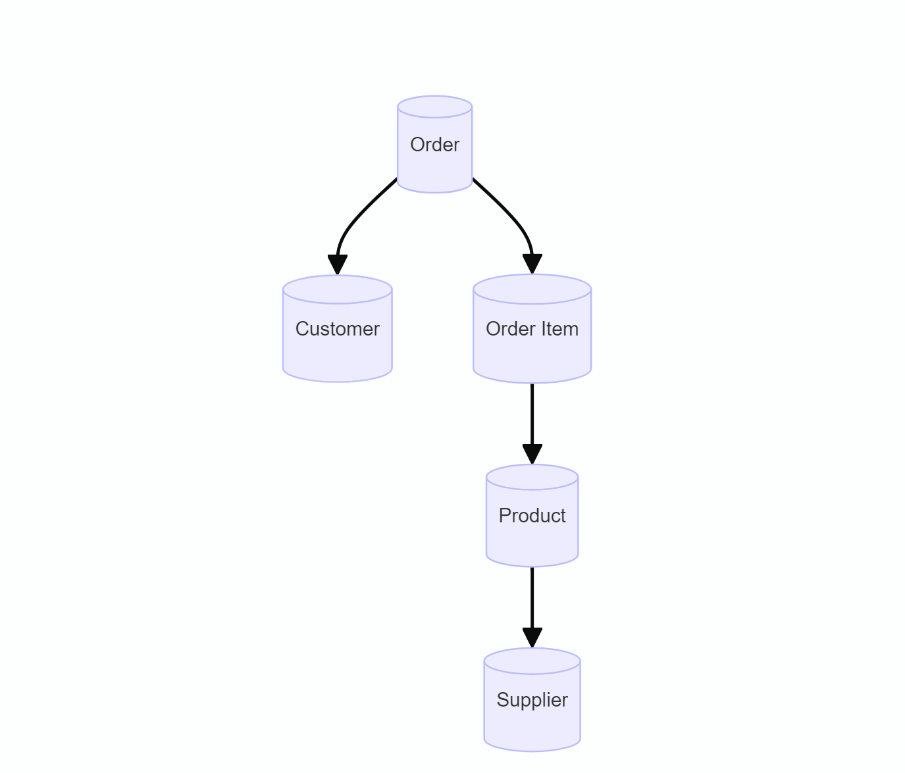

# Design Document

By MAHESH VARDHAN

Video overview: <URL HERE>

# Design Document

By [Your Name Here]

Video overview: [URL HERE]

## Scope

In this section you should answer the following questions:

* What is the purpose of your database?

The purpose of the Amazon Store Inventory System database is to manage and track products, suppliers, customers, orders, and order items within the Amazon store. The database will facilitate efficient inventory management and order processing.

* Which people, places, things, etc. are you including in the scope of your database?

Included in the scope of the database are:
- Products: Information about each product available in the store, including name, description, price, and supplier.
- Suppliers: Information about suppliers who provide products to the store.
- Customers: Information about customers who place orders in the store.
- Orders: Details of customer orders, including order status and the customer who placed the order.
- Order Items: Specific products included in each order.

* Which people, places, things, etc. are *outside* the scope of your database?

Outside the scope of the database are:
- *Employee details:* Information about store employees is not included.
- *Detailed financial transactions:* While product prices are included, detailed financial records and transactions are not.
- *Customer payment methods:* Payment details are not stored in this database.
- *Marketing data:* Data related to marketing and sales strategies is not included.

## Functional Requirements

In this section you should answer the following questions:

* What should a user be able to do with your database?

Users of the database should be able to:
- Add new products, suppliers, customers, orders, and order items.
- Retrieve all products supplied by a specific supplier.
- Retrieve all orders placed by a specific customer.
- Retrieve all items in a specific order.
- Update existing records for products, suppliers, customers, orders, and order items.
- Delete records when necessary.

* What's beyond the scope of what a user should be able to do with your database?

The database will not support:
- Detailed financial reporting and analytics.
- Customer service interactions and history.
- Advanced inventory forecasting and supply chain management.

## Representation

### Entities

In this section you should answer the following questions:

* Which entities will you choose to represent in your database?
* What attributes will those entities have?
* Why did you choose the types you did?
* Why did you choose the constraints you did?

The database includes the following entities:

#### Products
- *id:* Unique identifier for each product (INTEGER, PRIMARY KEY).
- *name:* Name of the product (TEXT, NOT NULL).
- *description:* Description of the product (TEXT).
- *price:* Price of the product (NUMERIC, NOT NULL).
- *supplier_id:* ID of the supplier providing the product (INTEGER, FOREIGN KEY).

#### Suppliers
- *id:* Unique identifier for each supplier (INTEGER, PRIMARY KEY).
- *name:* Name of the supplier (TEXT, NOT NULL).

#### Customers
- *id:* Unique identifier for each customer (INTEGER, PRIMARY KEY).
- *first_name:* First name of the customer (TEXT, NOT NULL).
- *last_name:* Last name of the customer (TEXT, NOT NULL).
- *email:* Email address of the customer (TEXT, NOT NULL, UNIQUE).

#### Orders
- *id:* Unique identifier for each order (INTEGER, PRIMARY KEY).
- *customer_id:* ID of the customer who placed the order (INTEGER, FOREIGN KEY).
- *status:* Status of the order (TEXT, NOT NULL).

#### Order Items
- *id:* Unique identifier for each order item (INTEGER, PRIMARY KEY).
- *order_id:* ID of the order to which the item belongs (INTEGER, FOREIGN KEY).
- *product_id:* ID of the product in the order (INTEGER, FOREIGN KEY).
- *quantity:* Quantity of the product in the order (INTEGER, NOT NULL).

The types were chosen based on the nature of the data to be stored, ensuring that each attribute accurately represents its corresponding real-world concept. Constraints were applied to maintain data integrity and prevent issues such as duplicate entries (e.g., UNIQUE constraint on customer emails).

### Relationships

In this section you should include your entity relationship diagram and describe the relationships between the entities in your database.

The following entity relationship diagram describes the relationships between the entities in the database:

- *Products* are supplied by one *Supplier, but a **Supplier* can supply many *Products*.
- *Orders* are placed by one *Customer, but a **Customer* can place many *Orders*.
- *Order Items* belong to one *Order* and contain one *Product, but an **Order* can contain many *Order Items* and a *Product* can be part of many *Order Items*.

## Optimizations

In this section you should answer the following questions:

* Which optimizations (e.g., indexes, views) did you create? Why?

To optimize the performance of common queries, the following indexes were created:
- **Index on name in the suppliers table:** Speeds up lookups of products by supplier name.
- **Index on email in the customers table:** Speeds up lookups of orders by customer email.
- **Index on order_id in the order_items table:** Speeds up retrieval of items in a specific order.
- **Index on product_id in the order_items table:** Speeds up retrieval of order items for a specific product.

These optimizations ensure efficient data retrieval, especially for frequent queries.

## Limitations

In this section you should answer the following questions:

* What are the limitations of your design?
* What might your database not be able to represent very well?

The current design assumes a relatively simple inventory system and does not account for more complex scenarios such as:
- *Advanced inventory management:* Handling of stock levels, reordering, and inventory forecasting are not included.
- *Customer interactions:* Customer service interactions and history are not tracked.
- *Payment details:* The database does not store or process payment information.

Additionally, while the current schema supports basic CRUD operations, more advanced analytics and reporting would require further development and potentially more complex queries.

